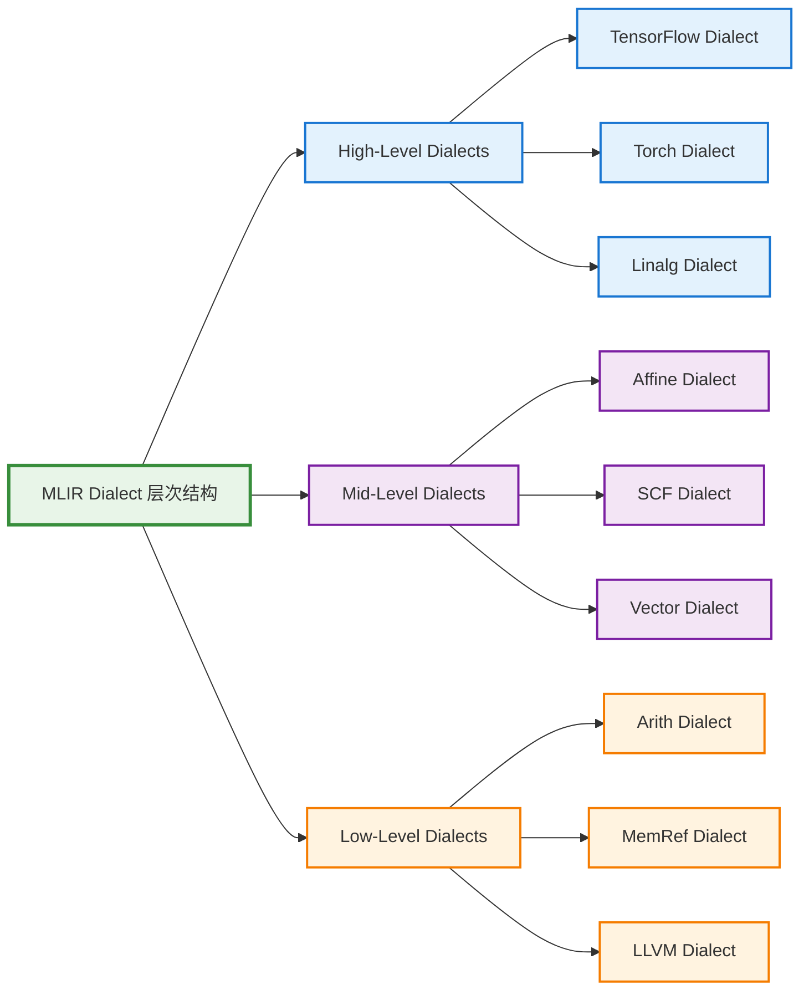
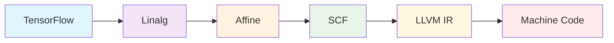

MLIR 是一个现代化的编译器基础设施，旨在解决传统编译器在处理多层抽象时的挑战。它提供了一个灵活的框架来定义和操作多级中间表示。

## 📋 章节概览


  
  
  
  
  
  


## 🎯 学习目标

通过本章节的学习，你将掌握：

- **MLIR 核心概念**: 理解 MLIR 的设计理念和基本组件
- **Dialect 开发**: 学会创建自定义的 Dialect
- **IR 操作**: 熟练操作 MLIR 中间表示
- **Pass 编写**: 实现自定义的变换和优化 Pass
- **Lowering 策略**: 掌握多级 Lowering 的设计模式

## 🔧 实践环节

### 环境搭建
```bash
# 克隆 LLVM 项目
git clone https://github.com/llvm/llvm-project.git
cd llvm-project

# 构建 MLIR
mkdir build && cd build
cmake -G Ninja ../llvm \
  -DLLVM_ENABLE_PROJECTS=mlir \
  -DLLVM_BUILD_EXAMPLES=ON \
  -DLLVM_TARGETS_TO_BUILD="Native;NVPTX;AMDGPU" \
  -DCMAKE_BUILD_TYPE=Release \
  -DLLVM_ENABLE_ASSERTIONS=ON

ninja check-mlir
```

### 第一个 MLIR 程序
```mlir
// hello.mlir
func.func @hello() {
  %0 = arith.constant 42 : i32
  %1 = arith.constant 1 : i32
  %2 = arith.addi %0, %1 : i32
  return
}
```

## 📚 核心概念预览

### Dialect 层次结构



### 典型的 Lowering 流程



## 🌟 MLIR 的优势

1. **可扩展性**: 通过 Dialect 系统支持领域特定的抽象
2. **可组合性**: 不同 Dialect 可以无缝集成
3. **渐进式 Lowering**: 支持多级渐进式降级
4. **强类型系统**: 提供丰富的类型检查机制
5. **优化友好**: 内置的 Pass 管理器支持复杂的优化流程

## 🔗 相关资源

- [MLIR 官方文档](https://mlir.llvm.org/)
- [MLIR 语言参考](https://mlir.llvm.org/docs/LangRef/)
- [MLIR Dialect 手册](https://mlir.llvm.org/docs/Dialects/)
- [MLIR 教程](https://mlir.llvm.org/docs/Tutorials/)
