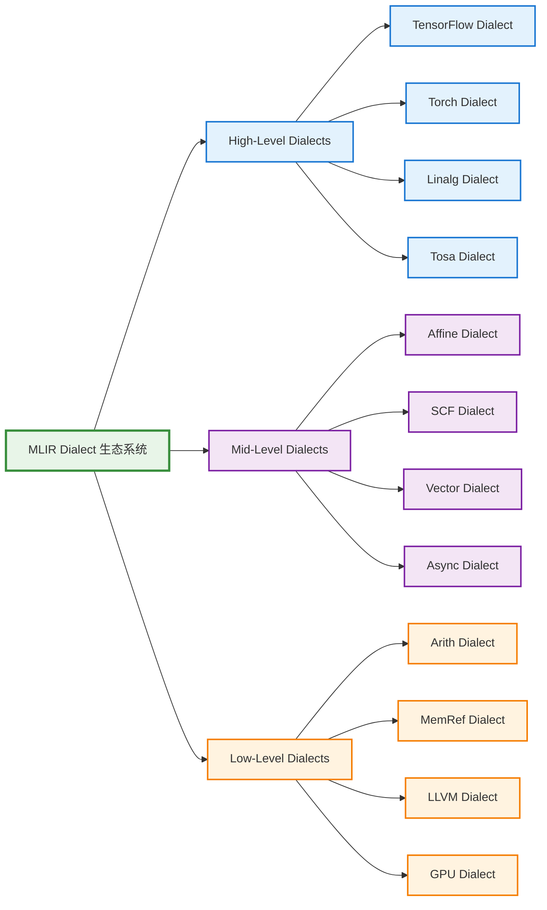
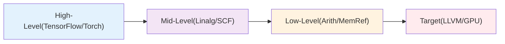

Dialect 是 MLIR 的核心概念之一，它提供了一种可扩展的方式来定义特定领域的操作、类型和属性。通过 Dialect 系统，MLIR 能够支持从高级抽象到低级实现的各种表示。

## 🎯 什么是 Dialect

Dialect 是一组相关的操作、类型和属性的集合，它们共同定义了一个特定的抽象层次或领域。每个 Dialect 都有自己的命名空间，避免了不同 Dialect 之间的冲突。

### 核心特性

- **模块化设计**: 每个 Dialect 都是独立的模块
- **可扩展性**: 可以轻松添加新的 Dialect
- **类型安全**: 强类型系统确保操作的正确性
- **渐进式降级**: 支持从高级到低级的逐步转换

## 📊 Dialect 层次结构



## 🔧 常用 Dialect 详解

### High-Level Dialects

#### TensorFlow Dialect
- **用途**: 表示 TensorFlow 操作
- **特点**: 直接映射 TensorFlow 图操作
- **示例**:
```mlir
%result = "tf.Add"(%lhs, %rhs) : (tensor<4xf32>, tensor<4xf32>) -> tensor<4xf32>
```

#### Linalg Dialect
- **用途**: 线性代数操作的高级表示
- **特点**: 支持张量操作的结构化表示
- **示例**:
```mlir
%result = linalg.matmul ins(%A, %B : tensor<4x8xf32>, tensor<8x16xf32>) 
                       outs(%C : tensor<4x16xf32>) -> tensor<4x16xf32>
```

### Mid-Level Dialects

#### SCF Dialect (Structured Control Flow)
- **用途**: 结构化控制流
- **特点**: 提供循环、条件等控制结构
- **示例**:
```mlir
scf.for %i = %c0 to %c10 step %c1 {
  %val = memref.load %buffer[%i] : memref<10xf32>
  // 循环体
}
```

#### Affine Dialect
- **用途**: 仿射循环和内存访问
- **特点**: 支持多面体编译优化
- **示例**:
```mlir
affine.for %i = 0 to 100 {
  affine.for %j = 0 to 200 {
    %val = affine.load %A[%i, %j] : memref<100x200xf32>
  }
}
```

### Low-Level Dialects

#### Arith Dialect
- **用途**: 基础算术操作
- **特点**: 类型化的算术运算
- **示例**:
```mlir
%sum = arith.addf %a, %b : f32
%product = arith.muli %x, %y : i32
```

#### MemRef Dialect
- **用途**: 内存引用和操作
- **特点**: 显式内存管理
- **示例**:
```mlir
%alloc = memref.alloc() : memref<1024xf32>
memref.store %value, %alloc[%index] : memref<1024xf32>
%loaded = memref.load %alloc[%index] : memref<1024xf32>
```

## 🔄 Dialect 转换示例

### 从 Linalg 到 SCF 的转换

**转换前 (Linalg)**:
```mlir
%result = linalg.generic {
  indexing_maps = [affine_map<(d0, d1) -> (d0, d1)>,
                   affine_map<(d0, d1) -> (d0, d1)>],
  iterator_types = ["parallel", "parallel"]
} ins(%input : tensor<4x8xf32>) outs(%output : tensor<4x8xf32>) {
^bb0(%in: f32, %out: f32):
  %add = arith.addf %in, %in : f32
  linalg.yield %add : f32
} -> tensor<4x8xf32>
```

**转换后 (SCF + MemRef)**:
```mlir
scf.for %i = %c0 to %c4 step %c1 {
  scf.for %j = %c0 to %c8 step %c1 {
    %val = memref.load %input[%i, %j] : memref<4x8xf32>
    %result = arith.addf %val, %val : f32
    memref.store %result, %output[%i, %j] : memref<4x8xf32>
  }
}
```

## 🛠️ 自定义 Dialect

### 定义新 Dialect

```cpp
// MyDialect.h
class MyDialect : public mlir::Dialect {
public:
  explicit MyDialect(mlir::MLIRContext *context);
  
  static constexpr llvm::StringLiteral getDialectNamespace() {
    return llvm::StringLiteral("my_dialect");
  }
  
  void initialize();
};
```

### 定义操作

```cpp
// MyOps.td (TableGen)
def My_AddOp : My_Op<"add", [Pure]> {
  let summary = "Custom addition operation";
  let arguments = (ins AnyFloat:$lhs, AnyFloat:$rhs);
  let results = (outs AnyFloat:$result);
  let assemblyFormat = "$lhs `,` $rhs attr-dict `:` type($result)";
}
```

## 📈 最佳实践

### 1. 选择合适的抽象层次
- 高级 Dialect 用于算法表达
- 中级 Dialect 用于优化
- 低级 Dialect 用于代码生成

### 2. 渐进式降级策略


### 3. 类型系统设计
- 使用强类型确保正确性
- 定义清晰的类型转换规则
- 避免隐式类型转换

## 🎯 应用场景

### 机器学习编译器
- **TensorFlow → Linalg → SCF → LLVM**
- 支持自动微分和优化

### 高性能计算
- **Affine → Vector → LLVM**
- 多面体优化和向量化

### 硬件设计
- **Custom HW Dialect → RTL**
- 硬件描述语言生成

## 📚 学习路径

1. **基础概念**: 理解 Dialect 的作用和设计原理
2. **常用 Dialect**: 熟悉标准 Dialect 的使用
3. **转换 Pass**: 学习 Dialect 之间的转换
4. **自定义 Dialect**: 实践创建自己的 Dialect
5. **优化技术**: 掌握基于 Dialect 的优化方法
