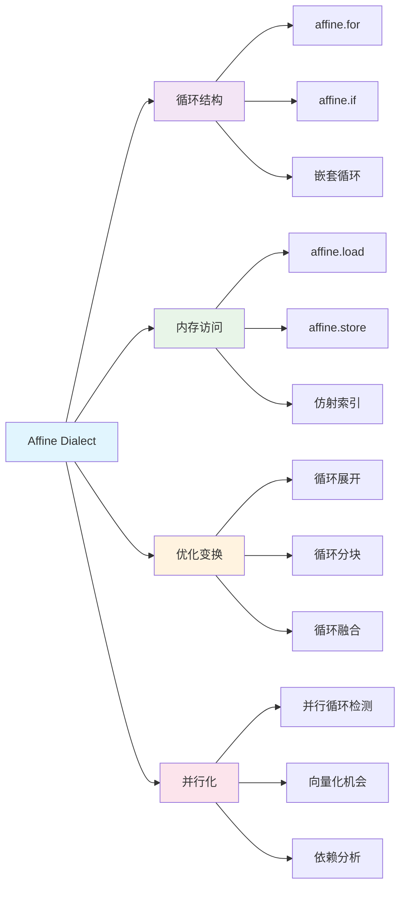

Affine Dialect 是 MLIR 中专门用于表示和优化仿射循环结构的方言。它提供了强大的循环分析和变换能力，是编译器优化的重要组成部分。

## 核心概念

### 仿射表达式 (Affine Expressions)

仿射表达式是形如 `a₀ + a₁x₁ + a₂x₂ + ... + aₙxₙ` 的线性表达式，其中：
- `aᵢ` 是常数系数
- `xᵢ` 是变量（通常是循环索引）

```mlir
// 仿射表达式示例
%c0 = arith.constant 0 : index
%c1 = arith.constant 1 : index
%c10 = arith.constant 10 : index

// 简单的仿射循环
affine.for %i = 0 to 10 {
  // 循环体
}

// 带步长的仿射循环
affine.for %i = 0 to 100 step 2 {
  // 步长为 2 的循环
}
```

### 仿射映射 (Affine Maps)

仿射映射定义了输入维度到输出维度的仿射变换：

```mlir
// 定义仿射映射
#map0 = affine_map<(d0, d1) -> (d0 + d1)>
#map1 = affine_map<(d0, d1) -> (d0 * 2 + d1)>
#map2 = affine_map<(d0, d1, d2) -> (d0, d1 + d2)>

// 在循环中使用仿射映射
affine.for %i = 0 to 10 {
  affine.for %j = 0 to 20 {
    %idx = affine.apply #map0(%i, %j)
    // 使用计算出的索引
  }
}
```

## 主要特性



## 核心操作

### 1. affine.for - 仿射循环

```mlir
// 基本语法
affine.for %i = lower_bound to upper_bound step step_value {
  // 循环体
}

// 实际示例：矩阵乘法的一部分
func.func @matrix_multiply(%A: memref<1024x1024xf32>, 
                         %B: memref<1024x1024xf32>, 
                         %C: memref<1024x1024xf32>) {
  %c0 = arith.constant 0.0 : f32
  
  affine.for %i = 0 to 1024 {
    affine.for %j = 0 to 1024 {
      affine.for %k = 0 to 1024 {
        %a = affine.load %A[%i, %k] : memref<1024x1024xf32>
        %b = affine.load %B[%k, %j] : memref<1024x1024xf32>
        %c = affine.load %C[%i, %j] : memref<1024x1024xf32>
        %prod = arith.mulf %a, %b : f32
        %sum = arith.addf %c, %prod : f32
        affine.store %sum, %C[%i, %j] : memref<1024x1024xf32>
      }
    }
  }
  return
}
```

### 2. affine.if - 条件分支

```mlir
// 仿射条件判断
affine.for %i = 0 to 100 {
  affine.for %j = 0 to 100 {
    // 只处理上三角矩阵
    affine.if #set0(%i, %j) {
      %val = affine.load %matrix[%i, %j] : memref<100x100xf32>
      // 处理上三角部分
    } else {
      // 处理下三角部分
    }
  }
}

// 定义条件集合
#set0 = affine_set<(d0, d1) : (d0 - d1 >= 0)>
```

### 3. affine.load/store - 内存访问

```mlir
// 复杂的仿射内存访问模式
func.func @complex_access(%input: memref<100x100xf32>, 
                         %output: memref<100x100xf32>) {
  affine.for %i = 0 to 98 {
    affine.for %j = 0 to 98 {
      // 3x3 卷积核的仿射访问
      %v00 = affine.load %input[%i, %j] : memref<100x100xf32>
      %v01 = affine.load %input[%i, %j + 1] : memref<100x100xf32>
      %v02 = affine.load %input[%i, %j + 2] : memref<100x100xf32>
      %v10 = affine.load %input[%i + 1, %j] : memref<100x100xf32>
      %v11 = affine.load %input[%i + 1, %j + 1] : memref<100x100xf32>
      %v12 = affine.load %input[%i + 1, %j + 2] : memref<100x100xf32>
      %v20 = affine.load %input[%i + 2, %j] : memref<100x100xf32>
      %v21 = affine.load %input[%i + 2, %j + 1] : memref<100x100xf32>
      %v22 = affine.load %input[%i + 2, %j + 2] : memref<100x100xf32>
      
      // 计算卷积结果
      %sum = arith.addf %v00, %v01 : f32
      %sum1 = arith.addf %sum, %v02 : f32
      // ... 更多计算
      
      affine.store %sum1, %output[%i, %j] : memref<100x100xf32>
    }
  }
  return
}
```

## 优化变换

### 1. 循环分块 (Loop Tiling)

```mlir
// 原始循环
affine.for %i = 0 to 1024 {
  affine.for %j = 0 to 1024 {
    // 计算
  }
}

// 分块后的循环
affine.for %ii = 0 to 1024 step 64 {
  affine.for %jj = 0 to 1024 step 64 {
    affine.for %i = #map_lb(%ii) to min(#map_ub(%ii), 1024) {
      affine.for %j = #map_lb(%jj) to min(#map_ub(%jj), 1024) {
        // 计算
      }
    }
  }
}

#map_lb = affine_map<(d0) -> (d0)>
#map_ub = affine_map<(d0) -> (d0 + 64)>
```

### 2. 循环展开 (Loop Unrolling)

```mlir
// 原始循环
affine.for %i = 0 to 4 {
  %val = affine.load %array[%i] : memref<4xf32>
  %result = arith.mulf %val, %val : f32
  affine.store %result, %output[%i] : memref<4xf32>
}

// 完全展开后
%val0 = affine.load %array[0] : memref<4xf32>
%result0 = arith.mulf %val0, %val0 : f32
affine.store %result0, %output[0] : memref<4xf32>

%val1 = affine.load %array[1] : memref<4xf32>
%result1 = arith.mulf %val1, %val1 : f32
affine.store %result1, %output[1] : memref<4xf32>

%val2 = affine.load %array[2] : memref<4xf32>
%result2 = arith.mulf %val2, %val2 : f32
affine.store %result2, %output[2] : memref<4xf32>

%val3 = affine.load %array[3] : memref<4xf32>
%result3 = arith.mulf %val3, %val3 : f32
affine.store %result3, %output[3] : memref<4xf32>
```

### 3. 循环融合 (Loop Fusion)

```mlir
// 原始的两个独立循环
affine.for %i = 0 to 100 {
  %val = affine.load %A[%i] : memref<100xf32>
  %result = arith.mulf %val, %val : f32
  affine.store %result, %B[%i] : memref<100xf32>
}

affine.for %i = 0 to 100 {
  %val = affine.load %B[%i] : memref<100xf32>
  %result = arith.addf %val, %val : f32
  affine.store %result, %C[%i] : memref<100xf32>
}

// 融合后的循环
affine.for %i = 0 to 100 {
  %val = affine.load %A[%i] : memref<100xf32>
  %square = arith.mulf %val, %val : f32
  affine.store %square, %B[%i] : memref<100xf32>
  
  %double = arith.addf %square, %square : f32
  affine.store %double, %C[%i] : memref<100xf32>
}
```

## 依赖分析

### 数据依赖检测

```mlir
// 存在依赖的循环
affine.for %i = 1 to 100 {
  %prev = affine.load %array[%i - 1] : memref<100xf32>
  %curr = affine.load %array[%i] : memref<100xf32>
  %sum = arith.addf %prev, %curr : f32
  affine.store %sum, %array[%i] : memref<100xf32>
  // 存在循环携带依赖：array[i] 依赖于 array[i-1]
}

// 无依赖的循环（可并行化）
affine.for %i = 0 to 100 {
  %val = affine.load %input[%i] : memref<100xf32>
  %result = arith.mulf %val, %val : f32
  affine.store %result, %output[%i] : memref<100xf32>
  // 每次迭代独立，可以并行执行
}
```

## 实际应用示例

### 1. 图像卷积

```mlir
func.func @conv2d(%input: memref<224x224x3xf32>,
                  %kernel: memref<3x3x3x64xf32>,
                  %output: memref<222x222x64xf32>) {
  %c0 = arith.constant 0.0 : f32
  
  // 初始化输出
  affine.for %oh = 0 to 222 {
    affine.for %ow = 0 to 222 {
      affine.for %oc = 0 to 64 {
        affine.store %c0, %output[%oh, %ow, %oc] : memref<222x222x64xf32>
      }
    }
  }
  
  // 卷积计算
  affine.for %oh = 0 to 222 {
    affine.for %ow = 0 to 222 {
      affine.for %oc = 0 to 64 {
        affine.for %kh = 0 to 3 {
          affine.for %kw = 0 to 3 {
            affine.for %ic = 0 to 3 {
              %ih = arith.addi %oh, %kh : index
              %iw = arith.addi %ow, %kw : index
              
              %input_val = affine.load %input[%ih, %iw, %ic] : memref<224x224x3xf32>
              %kernel_val = affine.load %kernel[%kh, %kw, %ic, %oc] : memref<3x3x3x64xf32>
              %output_val = affine.load %output[%oh, %ow, %oc] : memref<222x222x64xf32>
              
              %prod = arith.mulf %input_val, %kernel_val : f32
              %sum = arith.addf %output_val, %prod : f32
              
              affine.store %sum, %output[%oh, %ow, %oc] : memref<222x222x64xf32>
            }
          }
        }
      }
    }
  }
  return
}
```

### 2. 矩阵转置

```mlir
func.func @matrix_transpose(%input: memref<1024x1024xf32>,
                           %output: memref<1024x1024xf32>) {
  affine.for %i = 0 to 1024 {
    affine.for %j = 0 to 1024 {
      %val = affine.load %input[%i, %j] : memref<1024x1024xf32>
      affine.store %val, %output[%j, %i] : memref<1024x1024xf32>
    }
  }
  return
}
```

## 性能优化技巧

### 1. 内存访问优化

```mlir
// 优化前：列优先访问（缓存不友好）
affine.for %j = 0 to 1024 {
  affine.for %i = 0 to 1024 {
    %val = affine.load %matrix[%i, %j] : memref<1024x1024xf32>
    // 处理
  }
}

// 优化后：行优先访问（缓存友好）
affine.for %i = 0 to 1024 {
  affine.for %j = 0 to 1024 {
    %val = affine.load %matrix[%i, %j] : memref<1024x1024xf32>
    // 处理
  }
}
```

### 2. 分块优化

```mlir
// 针对缓存的分块策略
%tile_size = arith.constant 64 : index

affine.for %ii = 0 to 1024 step 64 {
  affine.for %jj = 0 to 1024 step 64 {
    affine.for %kk = 0 to 1024 step 64 {
      // 在分块内进行密集计算
      affine.for %i = #map_max(%ii, 0) to #map_min(#map_add(%ii, 64), 1024) {
        affine.for %j = #map_max(%jj, 0) to #map_min(#map_add(%jj, 64), 1024) {
          affine.for %k = #map_max(%kk, 0) to #map_min(#map_add(%kk, 64), 1024) {
            // 矩阵乘法核心计算
          }
        }
      }
    }
  }
}
```

## 调试和分析

### 1. 依赖分析工具

```bash
# 使用 MLIR 工具分析依赖
mlir-opt --affine-loop-analysis input.mlir
mlir-opt --test-affine-data-copy input.mlir
```

### 2. 性能分析

```mlir
// 添加性能标记
func.func @benchmark_loop() {
  %start = func.call @get_time() : () -> i64
  
  affine.for %i = 0 to 1000000 {
    // 计算密集型操作
  }
  
  %end = func.call @get_time() : () -> i64
  %duration = arith.subi %end, %start : i64
  func.call @print_time(%duration) : (i64) -> ()
  return
}
```

## 最佳实践

### 1. 循环结构设计
- **保持仿射性**：确保循环边界和索引表达式是仿射的
- **避免复杂条件**：尽量使用简单的仿射条件
- **合理嵌套**：根据数据访问模式设计循环嵌套顺序

### 2. 内存访问模式
- **局部性原理**：优化空间和时间局部性
- **缓存友好**：按行优先或列优先一致访问
- **减少间接访问**：避免通过指针的间接内存访问

### 3. 优化策略
- **渐进优化**：从简单优化开始，逐步应用复杂变换
- **性能测量**：每次优化后测量性能变化
- **平衡权衡**：在代码大小和执行速度之间找到平衡

## 应用场景

1. **科学计算**：线性代数、数值分析
2. **图像处理**：卷积、滤波、变换
3. **机器学习**：神经网络训练和推理
4. **信号处理**：FFT、滤波器设计
5. **高性能计算**：并行算法优化

## 学习路径

1. **基础概念**：理解仿射表达式和映射
2. **基本操作**：掌握 affine.for、affine.if 等操作
3. **优化技术**：学习循环变换和优化策略
4. **实际应用**：在具体项目中应用 Affine Dialect
5. **高级主题**：多面体编译、自动并行化

Affine Dialect 是 MLIR 中功能强大的循环优化工具，掌握它对于编写高性能代码至关重要。
