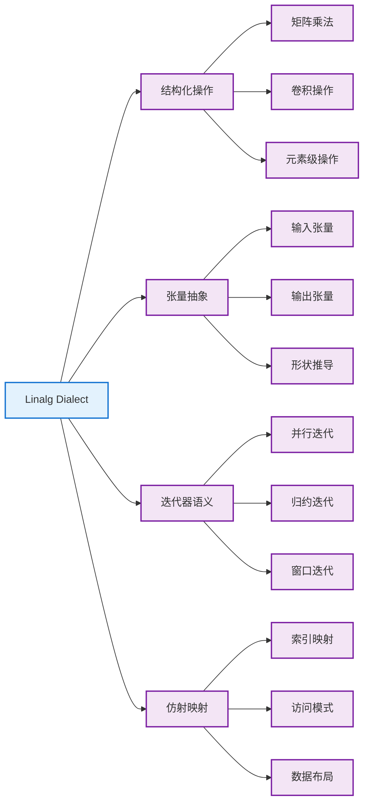

Linalg (Linear Algebra) Dialect 是 MLIR 中用于表示线性代数操作的高级方言。它提供了一种结构化的方式来表示张量操作，是连接高级机器学习框架和低级优化的重要桥梁。

## 🎯 核心概念

### 什么是 Linalg

Linalg Dialect 专注于表示**结构化的线性代数操作**，它的设计目标是：

- **可组合性**: 操作可以轻松组合和嵌套
- **可优化性**: 提供丰富的优化机会
- **可降级性**: 能够逐步降级到更低级的表示
- **硬件无关性**: 不绑定特定的硬件实现

### 核心特性



## 🔧 核心操作

### 1. linalg.generic

最通用的 Linalg 操作，可以表示任意的结构化计算：

```mlir
%result = linalg.generic {
  indexing_maps = [
    affine_map<(d0, d1) -> (d0, d1)>,     // 输入映射
    affine_map<(d0, d1) -> (d0, d1)>      // 输出映射
  ],
  iterator_types = ["parallel", "parallel"]  // 迭代器类型
} ins(%input : tensor<4x8xf32>) 
  outs(%output : tensor<4x8xf32>) {
^bb0(%in: f32, %out: f32):
  %add = arith.addf %in, %in : f32
  linalg.yield %add : f32
} -> tensor<4x8xf32>
```

### 2. 命名操作

#### 矩阵乘法 (linalg.matmul)

```mlir
// C = A * B
%C = linalg.matmul 
  ins(%A, %B : tensor<4x8xf32>, tensor<8x16xf32>) 
  outs(%C_init : tensor<4x16xf32>) -> tensor<4x16xf32>
```

#### 批量矩阵乘法 (linalg.batch_matmul)

```mlir
// C[b] = A[b] * B[b]
%C = linalg.batch_matmul 
  ins(%A, %B : tensor<2x4x8xf32>, tensor<2x8x16xf32>) 
  outs(%C_init : tensor<2x4x16xf32>) -> tensor<2x4x16xf32>
```

#### 卷积操作 (linalg.conv_2d)

```mlir
// 2D 卷积: output = conv2d(input, filter)
%output = linalg.conv_2d 
  ins(%input, %filter : tensor<1x32x32x3xf32>, tensor<3x3x3x64xf32>) 
  outs(%output_init : tensor<1x30x30x64xf32>) -> tensor<1x30x30x64xf32>
```

### 3. 元素级操作

#### 加法 (linalg.add)

```mlir
%result = linalg.add 
  ins(%lhs, %rhs : tensor<4x8xf32>, tensor<4x8xf32>) 
  outs(%output : tensor<4x8xf32>) -> tensor<4x8xf32>
```

#### 乘法 (linalg.mul)

```mlir
%result = linalg.mul 
  ins(%lhs, %rhs : tensor<4x8xf32>, tensor<4x8xf32>) 
  outs(%output : tensor<4x8xf32>) -> tensor<4x8xf32>
```

## 📊 迭代器类型

Linalg 使用迭代器类型来描述计算的语义：

### 并行迭代器 (parallel)

```mlir
// 元素级加法 - 所有元素可以并行计算
iterator_types = ["parallel", "parallel"]
```

### 归约迭代器 (reduction)

```mlir
// 矩阵乘法 - k 维度是归约维度
iterator_types = ["parallel", "parallel", "reduction"]
```

### 窗口迭代器 (window)

```mlir
// 卷积操作 - 滑动窗口计算
iterator_types = ["parallel", "parallel", "window", "window"]
```

## 🗺️ 仿射映射

仿射映射定义了输入输出张量的访问模式：

### 基本映射示例

```mlir
// 矩阵乘法的映射
indexing_maps = [
  affine_map<(m, n, k) -> (m, k)>,  // A[m, k]
  affine_map<(m, n, k) -> (k, n)>,  // B[k, n]
  affine_map<(m, n, k) -> (m, n)>   // C[m, n]
]
```

### 广播映射

```mlir
// 向量加法广播
indexing_maps = [
  affine_map<(d0, d1) -> (d0, d1)>,  // 矩阵 A
  affine_map<(d0, d1) -> (d1)>,      // 向量 b (广播)
  affine_map<(d0, d1) -> (d0, d1)>   // 结果矩阵
]
```

## 🔄 转换和优化

### 1. Tiling (分块)

将大的操作分解为小块，提高缓存局部性：

```mlir
// 原始矩阵乘法
%C = linalg.matmul ins(%A, %B : tensor<1024x1024xf32>, tensor<1024x1024xf32>) 
                   outs(%C_init : tensor<1024x1024xf32>) -> tensor<1024x1024xf32>

// 分块后 (32x32 块)
scf.for %i = %c0 to %c1024 step %c32 {
  scf.for %j = %c0 to %c1024 step %c32 {
    scf.for %k = %c0 to %c1024 step %c32 {
      %A_slice = tensor.extract_slice %A[%i, %k] [32, 32] [1, 1]
      %B_slice = tensor.extract_slice %B[%k, %j] [32, 32] [1, 1]
      %C_slice = tensor.extract_slice %C[%i, %j] [32, 32] [1, 1]
      %result = linalg.matmul ins(%A_slice, %B_slice : tensor<32x32xf32>, tensor<32x32xf32>) 
                              outs(%C_slice : tensor<32x32xf32>) -> tensor<32x32xf32>
      %C = tensor.insert_slice %result into %C[%i, %j] [32, 32] [1, 1]
    }
  }
}
```

### 2. Fusion (融合)

将多个操作融合为一个，减少内存访问：

```mlir
// 融合前：两个独立操作
%temp = linalg.add ins(%A, %B : tensor<4x8xf32>, tensor<4x8xf32>) 
                   outs(%temp_init : tensor<4x8xf32>) -> tensor<4x8xf32>
%result = linalg.mul ins(%temp, %C : tensor<4x8xf32>, tensor<4x8xf32>) 
                     outs(%result_init : tensor<4x8xf32>) -> tensor<4x8xf32>

// 融合后：单个操作
%result = linalg.generic {
  indexing_maps = [
    affine_map<(d0, d1) -> (d0, d1)>,  // A
    affine_map<(d0, d1) -> (d0, d1)>,  // B
    affine_map<(d0, d1) -> (d0, d1)>,  // C
    affine_map<(d0, d1) -> (d0, d1)>   // result
  ],
  iterator_types = ["parallel", "parallel"]
} ins(%A, %B, %C : tensor<4x8xf32>, tensor<4x8xf32>, tensor<4x8xf32>) 
  outs(%result_init : tensor<4x8xf32>) {
^bb0(%a: f32, %b: f32, %c: f32, %out: f32):
  %add = arith.addf %a, %b : f32
  %mul = arith.mulf %add, %c : f32
  linalg.yield %mul : f32
} -> tensor<4x8xf32>
```

### 3. 向量化 (Vectorization)

将标量操作转换为向量操作：

```mlir
// 向量化前：标量操作
scf.for %i = %c0 to %c1024 step %c1 {
  %val = memref.load %A[%i] : memref<1024xf32>
  %result = arith.mulf %val, %val : f32
  memref.store %result, %B[%i] : memref<1024xf32>
}

// 向量化后：向量操作
scf.for %i = %c0 to %c1024 step %c8 {
  %vec = vector.load %A[%i] : memref<1024xf32>, vector<8xf32>
  %result = arith.mulf %vec, %vec : vector<8xf32>
  vector.store %result, %B[%i] : memref<1024xf32>, vector<8xf32>
}
```

## 🎯 实际应用示例

### 深度学习中的全连接层

```mlir
func.func @fully_connected(
  %input: tensor<32x784xf32>,    // batch_size x input_dim
  %weight: tensor<784x128xf32>,  // input_dim x output_dim
  %bias: tensor<128xf32>         // output_dim
) -> tensor<32x128xf32> {
  
  // 初始化输出张量
  %c0 = arith.constant 0.0 : f32
  %output_init = tensor.empty() : tensor<32x128xf32>
  %output_zero = linalg.fill ins(%c0 : f32) outs(%output_init : tensor<32x128xf32>) -> tensor<32x128xf32>
  
  // 矩阵乘法: output = input * weight
  %matmul_result = linalg.matmul 
    ins(%input, %weight : tensor<32x784xf32>, tensor<784x128xf32>) 
    outs(%output_zero : tensor<32x128xf32>) -> tensor<32x128xf32>
  
  // 添加偏置: output = output + bias (广播)
  %final_result = linalg.generic {
    indexing_maps = [
      affine_map<(d0, d1) -> (d0, d1)>,  // matmul_result
      affine_map<(d0, d1) -> (d1)>,      // bias (广播)
      affine_map<(d0, d1) -> (d0, d1)>   // result
    ],
    iterator_types = ["parallel", "parallel"]
  } ins(%matmul_result, %bias : tensor<32x128xf32>, tensor<128xf32>) 
    outs(%output_init : tensor<32x128xf32>) {
  ^bb0(%mm: f32, %b: f32, %out: f32):
    %add = arith.addf %mm, %b : f32
    linalg.yield %add : f32
  } -> tensor<32x128xf32>
  
  return %final_result : tensor<32x128xf32>
}
```

### 2D 卷积层实现

```mlir
func.func @conv2d_layer(
  %input: tensor<1x28x28x1xf32>,     // NHWC format
  %filter: tensor<5x5x1x32xf32>,     // HWIO format
  %bias: tensor<32xf32>
) -> tensor<1x24x24x32xf32> {
  
  // 初始化输出
  %c0 = arith.constant 0.0 : f32
  %output_init = tensor.empty() : tensor<1x24x24x32xf32>
  %output_zero = linalg.fill ins(%c0 : f32) outs(%output_init : tensor<1x24x24x32xf32>) -> tensor<1x24x24x32xf32>
  
  // 2D 卷积
  %conv_result = linalg.conv_2d_nhwc_hwcf
    ins(%input, %filter : tensor<1x28x28x1xf32>, tensor<5x5x1x32xf32>)
    outs(%output_zero : tensor<1x24x24x32xf32>) -> tensor<1x24x24x32xf32>
  
  // 添加偏置
  %final_result = linalg.generic {
    indexing_maps = [
      affine_map<(d0, d1, d2, d3) -> (d0, d1, d2, d3)>,  // conv_result
      affine_map<(d0, d1, d2, d3) -> (d3)>,              // bias
      affine_map<(d0, d1, d2, d3) -> (d0, d1, d2, d3)>   // result
    ],
    iterator_types = ["parallel", "parallel", "parallel", "parallel"]
  } ins(%conv_result, %bias : tensor<1x24x24x32xf32>, tensor<32xf32>) 
    outs(%output_init : tensor<1x24x24x32xf32>) {
  ^bb0(%conv: f32, %b: f32, %out: f32):
    %add = arith.addf %conv, %b : f32
    linalg.yield %add : f32
  } -> tensor<1x24x24x32xf32>
  
  return %final_result : tensor<1x24x24x32xf32>
}
```

## 📈 性能优化技巧

### 1. 内存布局优化

```mlir
// 选择合适的内存布局
// 行主序 (Row-major) vs 列主序 (Column-major)
%A_row_major = tensor.empty() : tensor<1024x1024xf32>  // 默认行主序
%A_col_major = tensor.empty() : tensor<1024x1024xf32, #col_major_layout>
```

### 2. 数据类型优化

```mlir
// 使用混合精度
%input_fp16 = tensor.empty() : tensor<1024x1024xf16>   // 半精度输入
%weight_fp16 = tensor.empty() : tensor<1024x1024xf16> // 半精度权重
%output_fp32 = tensor.empty() : tensor<1024x1024xf32> // 单精度输出

// 混合精度矩阵乘法
%result = linalg.matmul 
  ins(%input_fp16, %weight_fp16 : tensor<1024x1024xf16>, tensor<1024x1024xf16>) 
  outs(%output_fp32 : tensor<1024x1024xf32>) -> tensor<1024x1024xf32>
```

### 3. 并行化策略

```mlir
// 使用 async dialect 进行异步并行
%token1 = async.execute {
  %result1 = linalg.matmul ins(%A1, %B1 : tensor<512x512xf32>, tensor<512x512xf32>) 
                           outs(%C1 : tensor<512x512xf32>) -> tensor<512x512xf32>
  async.yield %result1 : tensor<512x512xf32>
}

%token2 = async.execute {
  %result2 = linalg.matmul ins(%A2, %B2 : tensor<512x512xf32>, tensor<512x512xf32>) 
                           outs(%C2 : tensor<512x512xf32>) -> tensor<512x512xf32>
  async.yield %result2 : tensor<512x512xf32>
}

%final1 = async.await %token1 : tensor<512x512xf32>
%final2 = async.await %token2 : tensor<512x512xf32>
```

## 🔧 调试和分析

### 1. 打印中间结果

```mlir
// 使用 linalg.generic 添加调试输出
%debug_result = linalg.generic {
  indexing_maps = [affine_map<(d0, d1) -> (d0, d1)>],
  iterator_types = ["parallel", "parallel"]
} ins(%input : tensor<4x4xf32>) outs(%output : tensor<4x4xf32>) {
^bb0(%in: f32, %out: f32):
  // 可以在这里添加调试逻辑
  linalg.yield %in : f32
} -> tensor<4x4xf32>
```

### 2. 性能分析

```mlir
// 使用 func.call 包装操作进行性能测量
func.func @benchmark_matmul(%A: tensor<1024x1024xf32>, %B: tensor<1024x1024xf32>) -> tensor<1024x1024xf32> {
  %start_time = func.call @get_time() : () -> i64
  
  %C_init = tensor.empty() : tensor<1024x1024xf32>
  %result = linalg.matmul ins(%A, %B : tensor<1024x1024xf32>, tensor<1024x1024xf32>) 
                          outs(%C_init : tensor<1024x1024xf32>) -> tensor<1024x1024xf32>
  
  %end_time = func.call @get_time() : () -> i64
  %duration = arith.subi %end_time, %start_time : i64
  func.call @print_duration(%duration) : (i64) -> ()
  
  return %result : tensor<1024x1024xf32>
}
```

## 📚 最佳实践

### 1. 操作选择
- 优先使用命名操作（如 `linalg.matmul`）而不是通用操作
- 对于复杂计算，使用 `linalg.generic` 提供最大灵活性
- 考虑操作融合的可能性

### 2. 内存管理
- 合理使用 `tensor.empty()` 初始化输出张量
- 避免不必要的内存拷贝
- 考虑 in-place 操作的可能性

### 3. 类型系统
- 保持类型一致性
- 合理使用混合精度
- 注意张量形状的兼容性

### 4. 优化策略
- 从高级优化开始（融合、分块）
- 逐步降级到低级优化（向量化、并行化）
- 根据目标硬件调整优化策略

---




